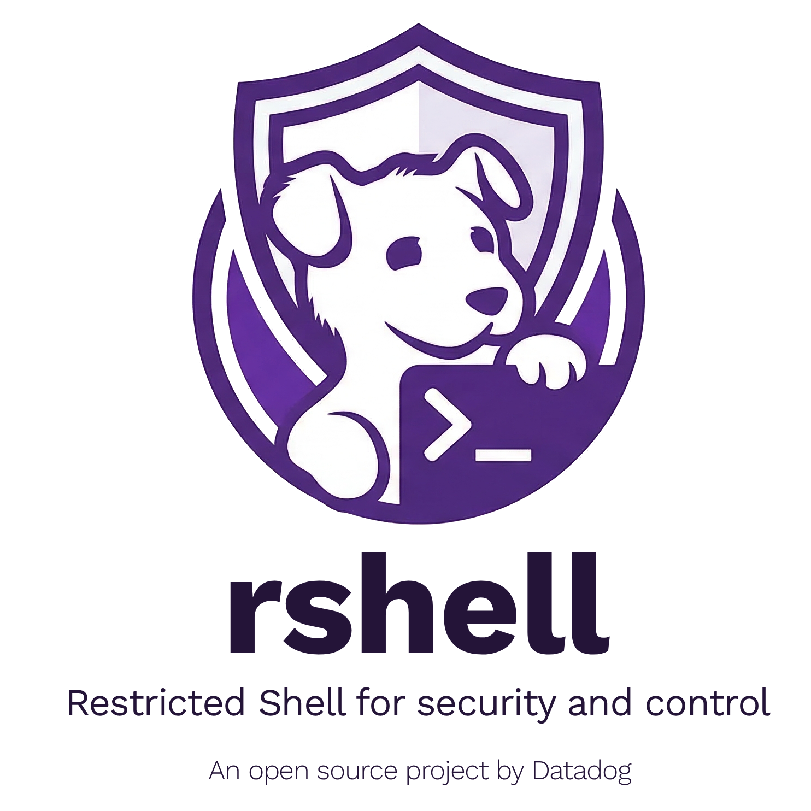

<p align="center">
  
</p>

# rshell - A Restricted Shell for AI Agents

[](https://github.com/DataDog/rshell/actions/workflows/test.yml)
[](LICENSE)

A restricted shell interpreter for Go. Designed for AI agents that need to run shell commands safely.

## Install

```bash
go get github.com/DataDog/rshell
```

## Quick Start

```go
package main

import (
	"context"
	"os"
	"strings"
	"time"

	"github.com/DataDog/rshell/interp"
	"mvdan.cc/sh/v3/syntax"
)

func main() {
	script := `echo "hello from rshell"`

	prog, _ := syntax.NewParser().Parse(strings.NewReader(script), "")

	runner, _ := interp.New(
		interp.StdIO(nil, os.Stdout, os.Stderr),
		interp.AllowedCommands([]string{"rshell:echo"}),
		interp.MaxExecutionTime(5*time.Second),
	)
	defer runner.Close()

	runner.Run(context.Background(), prog)
}
```

CLI usage also supports a whole-run timeout:

```bash
rshell --allow-all-commands --timeout 5s -c 'echo "hello from rshell"'
```

## Security Model

**CLI scope:** The `rshell` CLI is a development, debugging, and local validation harness for the interpreter. It is not intended to be exposed as a production execution boundary or as an interface for untrusted users. Production integrations should embed the Go API and set `AllowedCommands`, `AllowedPaths`, environment, timeout, and mode explicitly. Security review should treat the interpreter and embedding configuration as the security boundary, not the developer CLI.

Every access path is default-deny:

| Resource             | Default                             | Opt-in                                       |
|----------------------|-------------------------------------|----------------------------------------------|
| Command execution    | All commands blocked (exit code 127)| `AllowedCommands` with namespaced command list (e.g. `rshell:cat`) |
| Systemd services     | All services and actions blocked    | `AllowedSystemServices` with exact service/action grants |
| External commands    | Blocked (exit code 127)             | Provide an `ExecHandler`                     |
| Filesystem access    | Blocked                             | Configure `AllowedPaths` with `PATH[:ro|:rw]` root specs |
| Environment variables| Empty (no host env inherited)       | Pass variables via the `Env` option          |
| Output redirections  | Only `/dev/null` allowed in read-only mode (exit code 2 for other targets); file-target redirects enabled in remediation mode, gated by `AllowedPaths` | `>/dev/null`, `2>/dev/null`, `&>/dev/null`, `2>&1`; in remediation mode: `>FILE`, `>>FILE`, `2>FILE`, `&>FILE`, `&>>FILE` |

**AllowedCommands** restricts which commands (builtins or external) the interpreter may execute. Commands must be specified with the `rshell:` namespace prefix (e.g. `rshell:cat`, `rshell:echo`). If not set, no commands are allowed.

**AllowedSystemServices** is the single capability policy shared by systemd-aware builtins. Grants pair one exact service with generic actions (`read`, `clean`, `reload`, or `restart`), using `SERVICE:ACTION[+ACTION...]` syntax. Grants without actions are ignored; invalid services and unsupported actions are skipped with warnings. Service names are matched exactly without adding suffixes, resolving aliases, changing case, or otherwise normalizing them: `mysql` and `mysql.service` are different services. Empty service names, service names containing `:`, whitespace, path-like names, and glob patterns are also skipped with warnings. The policy defaults to denying every operation and remains enforced when all commands are allowed. `read` is available in read-only mode; mutating actions require remediation mode.

```go
interp.AllowedSystemServices([]interp.SystemdControlGrant{
	{
		Service: "mysql.service",
		Actions: []interp.SystemdAction{
			interp.SystemdActionRestart,
			interp.SystemdActionReload,
			interp.SystemdActionRead,
		},
	},
	{
		Service: "systemd-journald.service",
		Actions: []interp.SystemdAction{interp.SystemdActionRead, interp.SystemdActionClean},
	},
})
```

The development CLI accepts equivalent grants through `--allowed-services mysql.service:restart+reload+read,systemd-journald.service:read+clean`. Service selectors are always exact service names; `:` separates a selector from its actions and is not allowed inside service names. The restricted `journalctl` builtin is available as described below; `systemctl` is not yet implemented.

**SystemdTargetConfig** selects which Linux host systemd-aware builtins address. With no option, standard local paths are used. `Root` derives all paths beneath a mounted host root such as `/host`; host-absolute symlinks in machine-ID, journal-directory, and journald control-socket paths are resolved inside that root. Journal reads, usage scans, vacuuming, and socket pinning remain rooted throughout access. For unusual container mount layouts, callers may instead provide explicit journal directories, machine-id path, journald Varlink socket, and system bus socket. `Root` and explicit fields cannot be mixed. Once any explicit field is supplied, omitted fields stay unavailable and never fall back to local endpoints. The machine-id path is mandatory for every explicit target. The development CLI exposes the equivalent `--systemd-root` and `--systemd-*` path flags.

The target paths intentionally bypass `AllowedPaths`: they are trusted runner configuration and cannot be supplied by shell scripts. `Root` is the strongest way to keep files and endpoints on one host because every path is derived from the same mounted root. With explicit paths, the embedding application is responsible for mounting every supplied path from the same host. Every selected journal file header is checked against the configured machine ID, but journald's Rotate Varlink method does not return a machine ID that can independently attest its socket.

| Operation | Required target access |
|-----------|------------------------|
| Journal query, disk usage, or vacuum | `/etc/machine-id` and one or both of `/var/log/journal`, `/run/log/journal` |
| Journal rotation | `/etc/machine-id` and `/run/systemd/journal/io.systemd.journal` |
| Future `systemctl` manager operations | `/etc/machine-id` and `/run/dbus/system_bus_socket` |

Root targets derive those paths below `Root`; explicit targets may map them to arbitrary absolute container paths. A command fails closed when one of its required paths was omitted.

### Restricted journalctl

`journalctl` provides bounded investigation and disk-cleanup operations without executing the host binary or accepting user-selected files, directories, journal matches, cursors, machines, or namespaces.

| Operation | Supported flags | Required systemd grant |
|-----------|-----------------|------------------------|
| Exact service logs | `-u SERVICE` (repeatable), `-b`, `-n COUNT`, `--since TIME`, `-o short\|cat` | Exact `SERVICE:read` grant for every service |
| Current-boot kernel logs | `-k`, `-n COUNT`, `--since TIME`, `-o short\|cat` | `systemd-journald.service:read` |
| Allocated journal usage | `--disk-usage` | `systemd-journald.service:read` |
| Synchronous active-file rotation | `--rotate` | `systemd-journald.service:clean` plus remediation mode |
| Archived-file cleanup | `--vacuum-size SIZE`, `--vacuum-time AGE`, `--dry-run` | `systemd-journald.service:clean` plus remediation mode |

Log queries default to 100 entries and are capped at 1,000 entries and 32 exact unit scopes per invocation. `--since` accepts RFC 3339, local `YYYY-MM-DD HH:MM:SS`, or a non-negative Go lookback duration such as `15m`. `-b` means the newest boot present in the selected target journal, so it remains correct for a mounted host. Bare journal reads, globbed units, arbitrary field matches, follow mode, raw structured output, alternate sources, and arbitrary boot selection are unavailable.

Selected journal fields are capped at 64 KiB. `short` escapes embedded newlines, carriage returns, tabs, non-graphic Unicode code points, and invalid UTF-8 bytes before writing output; kernel entries without an identifier are labeled `kernel`, matching host `journalctl -k`. Within that bound, `cat` matches host `journalctl -o cat` by writing each `MESSAGE` value unchanged and appending one newline; callers must treat that raw output as untrusted log content.

Log reading uses a bounded pure-Go journal-file parser and does not execute host `journalctl` or require cgo or `libsystemd`. It supports regular and compact journal layouts, legacy and keyed DATA hashes, and XZ, LZ4, and Zstandard-compressed DATA objects. Unknown incompatible format features fail with a clear error.

The reader opens at most 128 regular, non-symlink journal files, verifies the machine ID and file identities before and after each query, and retries once if concurrent rotation or an in-progress write makes the first snapshot inconsistent. Rotation requires Linux, the configured journald Varlink socket, and procfs descriptor links at `/proc/self/fd`. The backend pins the socket inode before connecting through its descriptor, so a concurrent path replacement cannot redirect the request; rotation fails closed when descriptor links are unavailable. Disk usage and vacuuming use the mounted journal files directly on Linux or macOS. Used alone, `--vacuum-time` removes every eligible archive at least that old. `--vacuum-size` requires `--vacuum-time`; when combined, the age becomes a minimum deletion age and cleanup stops once the size target is reached, leaving newer archives intact even when usage remains above the target. `--rotate` may be combined with vacuum flags, but newly rotated archives remain protected by the time floor. `--dry-run` cannot be combined with `--rotate` and still requires the clean grant and remediation mode.

Vacuum thresholds are provided by the `journalctl` command itself. The backend removes only strict systemd archived-journal filenames, never active files, symlinks, hardlinks, or malformed names, and it revalidates each file immediately before deletion.

**AllowedPaths** restricts all file operations to specified directories using Go's `os.Root` API for reads and openat-based write handling for writes.

- **Sandbox mechanism:** Reads go through `os.Root`; writes are checked against the most-specific path mode and, on Unix, opened with a no-symlink `openat` walk. Files outside the allowlist cannot be opened, created, truncated, or appended to.
- **Permission suffix:** Path entries may end with `:ro` or `:rw` representing read-only and read-write modes, respectively; entries without a suffix default to read-only, and the suffix is stripped before path validation. In remediation mode, write operations are accepted only inside the most-specific matching `:rw` root.
- **Symlink policy:** A symlink pointing outside its `os.Root` is followed for reads but never for writes; on Unix, symlink components in write targets are rejected with `symlinks are not supported as write targets` rather than followed, eliminating the TOCTOU window where a malicious link target could be swapped between resolution and open.
- **Output redirections by mode:**
  - _Read-only mode (default):_ file-target output redirections (`>`, `>>`, `2>`, `&>`, `&>>`) are rejected at parse time (exit 2).
  - _Remediation mode:_ those redirections open through the same sandbox — writes inside `:rw` allowlist roots succeed; targets outside the allowlist or inside read-only roots fail with `permission denied` (exit 1).
- **Special targets:** The literal target `/dev/null` is always short-circuited to a discarded sink without going through the sandbox. `<>` (read-write open) is blocked in all modes.
- **Diagnostic messages:** Configured directories that cannot be opened and invalid system service names are skipped with a warning flushed once to the runner's stderr at construction time. Silence them or redirect them programmatically with `WarningsWriter(io.Writer)` or inspect them with `Runner.Warnings()`.

> **Note:** The `ss`, `ip route`, and `df` builtins bypass `AllowedPaths` for their kernel-state reads. `ss` and `ip route` open `/proc/net/*` paths directly; `df` reads `/proc/self/mountinfo` (Linux) or calls `getfsstat(2)` (macOS), then issues `unix.Statfs(2)` against every kernel-reported mount point. These paths are hardcoded — never derived from user input — and `Statfs` returns metadata only (block / inode counts, filesystem type, block size). There is no sandbox-escape risk, but operators cannot use `AllowedPaths` to block `ss` from enumerating local sockets, `ip route` from reading the routing table, or `df` from reporting mount-table capacity — these reads succeed regardless of the configured path policy.

**ProcPath** (Linux-only) overrides the proc filesystem root used by the `ps` builtin (default `/proc`). This is a privileged option set at runner construction time by trusted caller code — scripts cannot influence it. Access to the proc path is intentionally not subject to `AllowedPaths` restrictions. To avoid leaking secrets passed as CLI arguments, `ps` does not read `/proc/<pid>/cmdline`; the `CMD` column reports only the process comm/executable name.

**RemediationMode** opts the runner into host-remediation mode, enabling file-target output redirections (`>`, `>>`, `2>`, `&>`, `&>>`) within `:rw` entries in the configured `AllowedPaths` and enabling remediation-only builtins such as `truncate` and `logrotate`. Targets outside the allowlist or inside read-only roots are rejected with `permission denied` (exit 1); symlinked write targets are rejected with `symlinks are not supported as write targets`; `/dev/null` is always accepted. `<>` (read-write open) remains blocked in all modes. CLI flag: `--mode remediation` (default: `--mode read-only`). The `logrotate` builtin is an rshell-safe log truncation helper, not a full `logrotate(8)` replacement.

## Shell Features

Inside rshell, run `help` to list supported feature categories, a concise unsupported-feature summary, enabled commands, and the configured `AllowedPaths` sandbox roots grouped by read-only and read-write access (or a notice when none are configured). Use `help <feature|command>` for details about a specific rshell feature or command.

See [SHELL_FEATURES.md](SHELL_FEATURES.md) for the complete list of supported and blocked features.

## Platform Support

Linux, macOS, and Windows.

## Publishing Changes

After merging changes to `main` create a release by:

1. Navigate to the [Releases](https://github.com/DataDog/rshell/releases) page

2. Click "Draft a new release"

3. You can "Select a tag" using the dropdown or "Create a new tag"

   When creating a new tag, make sure to include the `v` prefix. For example, if the last release was v0.1.29, your release should be v0.1.30.

4. The release title should be the same as the version tag

5. Use "Generate release notes" to fill in the release description

6. Click "Publish release"

   This will create a git tag that can now be referenced in other repos. This will trigger go-releaser that will add installable artifacts to the release.

## License

[Apache License 2.0](LICENSE)
