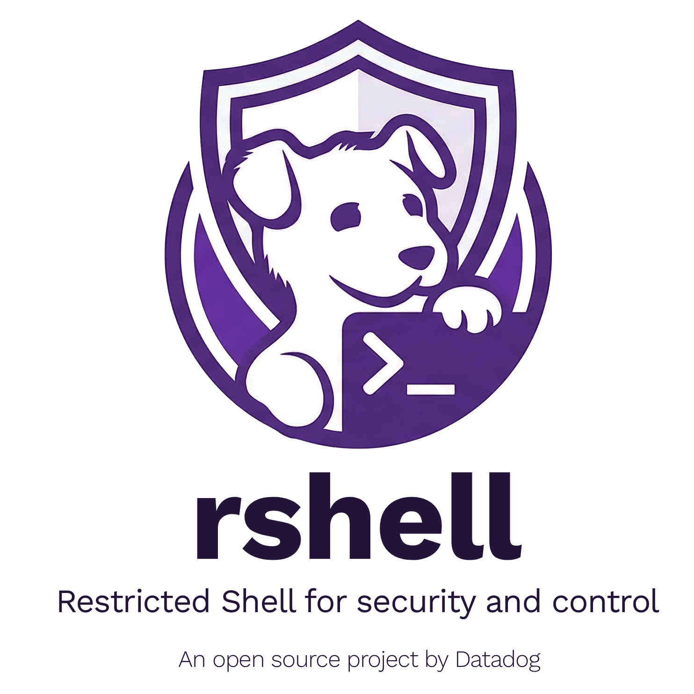

<p align="center">
  
</p>

# rshell

[](https://github.com/DataDog/rshell/actions/workflows/test.yml)
[](LICENSE)

A default-deny shell interpreter for Go, built for AI agents that need a bounded Bash/POSIX-like command surface.

> [!IMPORTANT]
> The CLI is a development and local-validation tool, not a production security boundary. Production integrations should embed the Go package and explicitly configure commands, paths, environment, timeouts, and execution mode.

## Install

```bash
go get github.com/DataDog/rshell/interp
```

For the optional development CLI:

```bash
go install github.com/DataDog/rshell/cmd/rshell@latest
```

## Quick start

A minimal embedded runner (imports omitted):

```go
func runScript(ctx context.Context) error {
	program, err := interp.ParseScript(`echo "hello from rshell"`, "")
	if err != nil {
		return err
	}

	runner, err := interp.New(
		interp.StdIO(nil, os.Stdout, os.Stderr),
		interp.AllowedCommands([]string{"rshell:echo"}),
		interp.MaxExecutionTime(5*time.Second),
	)
	if err != nil {
		return err
	}
	defer runner.Close()

	return runner.Run(ctx, program)
}
```

See the [Go API reference](https://pkg.go.dev/github.com/DataDog/rshell/interp) for runner options and lifecycle details.

The same command through the development CLI:

```bash
rshell --allowed-commands rshell:echo --timeout 5s -c 'echo "hello from rshell"'
```

## Check a script without executing it

For checks against the **local execution host**, call `runner.Check(ctx, script)`
on a runner configured with the same options you would use for execution.
Integrations that decode a protobuf request can pass its script and effective
policies through the existing runner options. For grants intended for another
host, use `CheckRemote` below: constructing a runner opens local sandbox roots.

```go
runner, err := interp.New(
	interp.AllowedCommands([]string{"rshell:cat", "rshell:grep"}),
	interp.AllowedPaths([]string{"/var/log:ro"}),
)
if err != nil {
	return err
}
defer runner.Close()

report, err := runner.Check(ctx, `cat /var/log/app.log | grep ERROR`)
if err != nil {
	return err // cancellation, timeout, or invalid runner
}
// report.Allowed: all command sites passed the static authorization check.
// report.Commands: per-command allowed/status, source line/column, and issues.
// report.Issues: script-wide parse errors or unsupported shell features.
// report.Warnings: configuration warnings, including skipped AllowedPaths.
```

The JSON-compatible report distinguishes `allowed`, `denied`, and
`indeterminate`. Both the report and each command have an `Allowed` boolean,
which is true only for `allowed`. Issues have stable codes such as
`command_not_allowed`, `unknown_command`, `path_not_allowed`,
`remediation_required`, and `requires_execution`; path issues include the
requested path. A denial takes precedence over an indeterminate check.

Checking uses the shell parser, builtin flag parser, current runner environment
and directory, and the configured command, path, mode, elevation, and systemd
policies. It never executes commands or substitutions, consumes stdin, writes
redirects, or calls elevation/systemd backends. It may inspect sandboxed
filesystem metadata. The runner's state and output streams are unchanged.

This is a conservative authorization preview. Every syntactic branch is checked,
even one that might not run, and loops are inspected once. Simple assignments
and environment values are resolved. Globs, command substitutions, paths after
`cd`, and operations whose operands depend on file contents can be
`indeterminate`; see the [coverage details](SHELL_FEATURES.md#library-policy-checks).
An allowed report does not promise an exit code of zero, file existence, valid
embedded programs, sufficient OS privileges, or termination. Always execute
through `Run`, which enforces policy again against the state at execution time.

### Preview authorization for a remote host

```go
func CheckRemote(ctx context.Context, script string, policy interp.RemotePolicy) (*interp.CheckResult, error)
```

Call `interp.CheckRemote` after your application authenticates the caller,
resolves the target, authorizes persisted policies, and computes effective
grants. It shares the local checker's parsing, syntax and flag validation,
command traversal, policies, limits, and complete `CheckResult` envelope.
It does not construct a runner, read the embedding application's filesystem
or environment, look up its working directory, consume streams, or invoke
systemd/elevation backends. Remote grant roots need not exist locally.

```go
report, err := interp.CheckRemote(ctx, `echo checking; cat "$LOG"`, interp.RemotePolicy{
	AllowedCommands: []string{"rshell:echo", "rshell:cat"},
	AllowedPaths:    []string{"/var/log:ro"},
	Mode:            interp.ModeReadOnly,
	Env:             []string{"LOG=/var/log/app.log"},
	Dir:             "/var/log", // optional remote cwd; never inferred locally
	Timeout:         5 * time.Second,
})
if err != nil {
	return err // invalid configuration, cancellation, or timeout
}
// echo: allowed. cat: indeterminate/requires_execution, with Path=/var/log/app.log.
// Overall: Status=indeterminate, Allowed=false. Nothing executes.
```

`RemotePolicy` fields:

| Field | Meaning / default |
|---|---|
| `AllowedCommands []string` | Exact `rshell:<command>` grants; empty denies all commands |
| `AllowedPaths []string` | Absolute remote roots with optional `:ro` (default) or `:rw`; empty denies filesystem access |
| `Mode interp.Mode` | Empty or `ModeReadOnly` blocks remediation; `ModeRemediation` still requires the relevant grants |
| `AllowedSystemServices []interp.SystemServiceControlGrant` | Exact `Service` names and `Actions`; empty denies all service actions |
| `ElevatableCommands []string` | Additional `rshell:<command>` grants for the `sudo` marker; no callback; command grants are still required |
| `Env []string` | Explicit `KEY=value` pairs; empty by default, plus normal shell defaults |
| `Dir string` | Optional absolute remote cwd; without it, relative paths and `$PWD` are indeterminate |
| `Timeout time.Duration` | Fresh deadline per call; zero defaults to five seconds, negative is invalid; an earlier context deadline wins |

Malformed configuration is an error. Path grants reserve colons for one terminal
`:ro`/`:rw` suffix and Windows volume prefixes. Matching uses execution's lexical
containment and most-specific access-mode rules; read-only aliases cannot widen
writes. On POSIX, execution can interpret an existing literal suffix directory
as a read-only root; the preview preserves that possibility without inspecting
local metadata. `$ALLOWED_PATHS` is indeterminate when grants are configured,
because the target determines which roots actually open. Use the same rshell
version and platform conventions on the checking service and target; this API
does not translate Windows paths or builtin availability for a different OS.

Known missing grants produce `denied`. A lexically permitted file operation
produces `indeterminate`/`requires_execution`, because remote root existence,
symlink containment, file types, hard-link restrictions, and OS access still need
checking. There are no local "missing root" warnings. A denial takes precedence
over uncertainty. This is an **authorization preview, not an execution-success
guarantee**: actual execution must reauthorize against the target's current
policies and filesystem using the normal runner and sandbox.

## Security model

Policy is layered and default-deny:

| Surface | Default | Explicit opt-in |
|---|---|---|
| Commands | Denied | `AllowedCommands` with namespaced entries such as `rshell:cat` |
| Filesystem | Denied | `AllowedPaths` roots, optionally suffixed with `:ro` or `:rw` |
| Environment | Empty; the host environment is not inherited | `Env` |
| Writes and remediation commands | Disabled | `WithMode(ModeRemediation)` plus a matching `:rw` path or capability grant |
| Systemd | All units and actions denied | Exact unit/action grants through `AllowedSystemServices`; `systemctl` also requires remediation mode |

The Linux Private Action Runner integration adds a separate production boundary:
the socket-facing privileged helper verifies the signed task, then dispatches it
to a fresh one-shot worker. That worker derives Landlock rules from the verified
effective path, command, and system-service policies and installs the reviewed
seccomp denylist before executing the script. The signed action selects read-only
or remediation mode; either action may selectively elevate explicitly authorized
commands, while read-only actions receive no Landlock write rights. See [Privileged helper](docs/PRIVILEGED_HELPER.md)
for the lifecycle, kernel requirements, fixed builtin path grants, and syscall policy.

Only registered rshell builtins are executable through the public API; host binaries and unknown commands are rejected. Read-only mode is the default; remediation mode enables only the separately authorized write and host-remediation surfaces.

Remediation-mode `sed -i` uses bounded, non-atomic writes with best-effort restoration. It rejects known oversized input before reading and caps each input/output buffer's capacity at 256 MiB. It reserves time within the write budget to resolve an abandoned writer; if the writer remains active, it reports an unknown outcome and skips restoration rather than racing it. Partial changes can remain; see the [feature reference](SHELL_FEATURES.md) for timeout and recovery limits.

For simple commands, rshell expands only enough words to identify the command, then applies command, elevation, and mode policy before expanding the remaining arguments, inline assignments, or redirects. A rejected command therefore cannot trigger command substitutions or redirect side effects through its unused arguments. Once a command is authorized, redirects retain normal shell semantics: they are established before execution and remain effective even if the command later exits nonzero.

Shell expansion is bounded independently of the execution timeout: a command may receive at most 16,384 expanded arguments totaling 10 MiB, and one `Run` may produce at most 64 MiB of expanded argument, assignment, redirect, and heredoc text across all loops, subshells, and pipeline stages. Individual variable values remain capped at 1 MiB and heredocs at 10 MiB.

Redirect targets undergo shell expansion and must resolve to exactly one field; ambiguous targets fail before the file is opened. Quoting preserves literal spaces and wildcard characters.

Some inspection builtins read fixed kernel interfaces outside `AllowedPaths`, and trusted systemd target paths intentionally bypass the filesystem sandbox. Their platform limits, data exposure, and authorization rules are documented in the [feature reference](SHELL_FEATURES.md).

## Features and platforms

Allow `rshell:help`, then run `help` to distinguish commands available now, allowlisted commands that require remediation mode, and commands disabled by policy; it also always shows an `Elevatable commands` section listing commands that may be prefixed with `sudo`, or an explicit notice when none qualify. Use `help <command>` for command-specific details. See [SHELL_FEATURES.md](SHELL_FEATURES.md) for the complete supported and blocked feature matrix.

The interpreter supports Linux, macOS, and Windows. Some host-inspection builtins are platform-specific; the feature reference calls those out individually.

## Development

See [CONTRIBUTING.md](CONTRIBUTING.md) for setup, testing, and pull request guidance. Security-sensitive builtin implementation rules live in [docs/RULES.md](docs/RULES.md).

## License

[Apache License 2.0](LICENSE)
