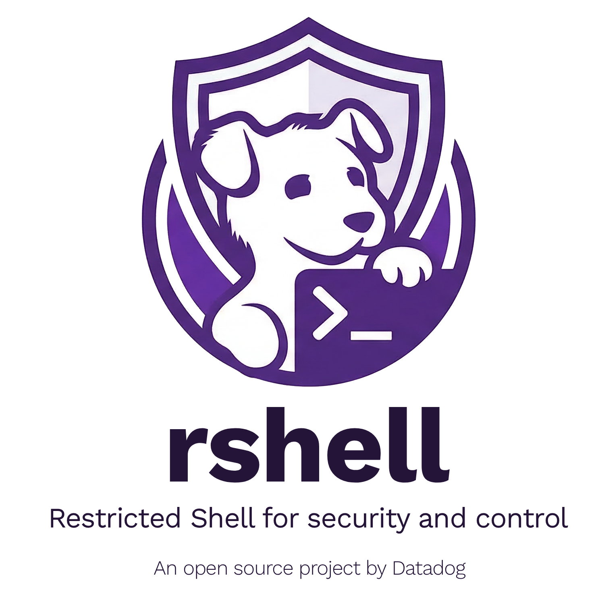

  

# Shell Power, Agent Safety: Building a Sandboxed Shell for AI, by AI

In about ten days, a small team merged 100 pull requests, shipped 20,000 lines of production Go, and wrote 4,500 tests for a POSIX-compatible shell interpreter. It's now open source at [github.com/DataDog/rshell](https://github.com/DataDog/rshell). Almost all of it was written and reviewed by AI.

That sentence probably raises more questions than it answers. How do you maintain code quality at that pace? How do you trust AI-generated code in a security-sensitive project? And why build a shell from scratch in the first place?

The answers turned out to be connected in ways we didn't expect.

## Why AI Agents Need a Shell

At Datadog, AI agents investigate production incidents. They need to dig through on-host data, log files, proc filesystems, network state, and a lot of that work has to happen locally. You can't always ship gigabytes of raw logs to a backend for analysis.

LLMs are trained on POSIX shell. When an agent needs to diagnose something, it reaches for `grep`, `find`, `tail`, pipes, loops. That's the right instinct. Pre-defined scripts are too rigid. Custom MCP tools require modeling every diagnostic workflow in advance. Shell scripting lets the agent improvise.

But giving an agent a real `bash` session on a production host is a non-starter. Standard POSIX tools carry risks that aren't obvious at first glance: `find` and `sed` can execute arbitrary binaries, `sort` can write to the filesystem, `grep`'s default regex engine can trivially DoS a machine, and `tail -n 9999999999999999` will OOM a host through greedy buffer allocation. Even the shell itself is a risk: a malicious binary planted on `$PATH` can silently replace any command. One prompt injection could turn an investigative agent into an attacker with full access.

We needed agents to read log files, filter text, and inspect system state, but not execute binaries, write to disk, or open network connections (except for `ping`). So we built a shell that only knows the commands we taught it, only accesses the paths we explicitly allow, and blocks everything else by default.

The shell will be integrated into the Datadog Agent as an MCP tool exposed over PAR (Private Action Runner), giving AI agents a secure execution environment on any monitored host.

## Designing the Restricted Shell

We needed a shell that was powerful enough to be useful and constrained enough to be safe. Three design decisions shaped the architecture.

### Parser and interpreter, separated

Shell scripts are parsed into an AST using [mvdan/sh](https://github.com/mvdan/sh), a well-maintained Go shell parser. We forked its interpreter and rebuilt it around our security model. This separation is the foundation of the security model: we control every operation. We can allow `for` loops and `if` clauses while blocking `exec` and `eval`. Unknown syntax is rejected at the grammar level before anything runs. The interpreter supports pipes, command substitution, variable expansion, globbing, enough to be genuinely useful without the features that make `bash` dangerous in untrusted contexts.

### Builtins, not host binaries

Every command, `cat`, `grep`, `find`, `sed`, `ss`, `ip`, and twenty more, is reimplemented as a Go function. The interpreter never calls a host binary.

**File access enforcement:** every file open goes through an `AllowedPaths` sandbox check using Go 1.24's [`os.Root` API](https://go.dev/blog/osroot). `os.Root` confines all file operations to a directory tree. Symlinks that escape are blocked, `..` cannot traverse out, and on Unix `openat` syscalls eliminate TOCTOU races. If the path isn't on the allowlist, the operation fails, on Linux, macOS, and Windows alike. Commands like `ps` have platform specific behaviour, but that's an exception.

**Cross-platform consistency:** the same `grep` implementation runs everywhere. No surprises from GNU vs. BSD flag differences. No missing utilities.

**No supply chain risk:** a malicious `ls` placed on `$PATH` is invisible to the shell. There is no `$PATH` to search. The interpreter dispatches directly to our Go functions.

### Layered security

The first layer is always on: interpreter restrictions, builtin-only execution, the path allowlist. A future improvement could add a second layer of OS-level sandboxing (e.g. using Landlock on Linux, App Sandbox on macOS, Windows Job Objects and SIDs).

Between these layers sits a library function allowlist. Every builtin has an explicit list of permitted Go standard library functions. `strings.Split` is allowed, anything from `os/exec` and `reflect` packages are not. CI enforces that no builtin calls a function outside its allowlist, and any change to the allowlists requires a human to review and approve before merging. AI can implement commands, but it can't grant itself access to new capabilities.

The tradeoff: we own the implementation risk. We mitigate that with testing, automated review, the library function allowlist that a human signs off on, and a development process that catches issues early.

## The AI Harness: Building with AI at Scale

AI handles the coding. Making it work across 25 commands, 100 PRs, and a security-sensitive codebase requires a more structured harness.

### The problem with ad-hoc AI coding

Using an AI assistant to write individual functions works fine. But when you have 25 commands to implement, each with its own POSIX spec, security surface, test suite, and review cycle, ad-hoc prompting stops working. You get inconsistency across implementations. Edge cases get missed in some commands but not others. Review fatigue sets in because every PR looks different.

### Skills as repeatable workflows

We built a set of _skills_, structured, step-by-step workflows that Claude Code follows for every command. The [implement-posix-command](https://github.com/DataDog/rshell/blob/2e4fe0721190641d0dfc8d9e0ce8c726f5c21868/.claude/skills/implement-posix-command/SKILL.md) skill defines a ten-step protocol:

1. **Research the command** — read the POSIX spec, study GTFOBins attack patterns
2. **Confirm flag selection** with the human before writing any code
3. **Write scenario tests** — POSIX-compliant tests validated against real `bash`
4. **Write Go unit tests** — covering edge cases and error paths
5. **Implement the command** — following the approved spec from step 2
6. **Verify and harden** — run all tests, fix failures, iterate
7. **Code review** — automated, multi-pass, covering security and correctness
8. **Exploratory pentest** — attack the command with specific categories: path traversal, integer overflow, infinite sources, flag injection
9. **Write fuzz tests** — for additional coverage beyond structured tests
10. **Update documentation** — keep feature docs in sync with implementation

Backing the skills is a shared rules file ([RULES.md](https://github.com/DataDog/rshell/blob/cb1141938dc02497247bb8ca6858b4ef84f18752/.claude/skills/implement-posix-command/RULES.md)) that codifies security constraints a builtin must satisfy: bounded buffers for untrusted input, regex execution limits to prevent ReDoS, integer overflow checks on all numeric arguments, sandbox-only file access, cross-platform path handling, and more. The rules file acts as a machine-readable security policy. The AI follows it on every implementation.

Every command went through this same pipeline. That consistency made review tractable. By the twentieth builtin, the reviewer already knew the structure, the test patterns, and the security invariants to check.

### The review-fix loop

For pull requests, a separate [review-fix-loop](https://github.com/DataDog/rshell/blob/2e4fe0721190641d0dfc8d9e0ce8c726f5c21868/.claude/skills/review-fix-loop/SKILL.md) skill runs code review, addresses comments, fixes CI failures, and iterates until the PR is clean without requiring a human in the loop for each cycle. The skill coordinates self-review in parallel with external review requests, then comment resolution, CI fixes, and a decision on whether another iteration is needed. The human approves the design; the harness handles the grunt work.

### What the human actually does

The role of the human engineer shifted. Less time writing code. More time on:

- **Defining the security rules** and invariants that the harness enforces
- **Approving flag selections** and design decisions before implementation starts
- **Verifying library function allowlists** — every PR that adds new standard library functions to a builtin's allowlist requires explicit human approval, ensuring AI-generated code never quietly expands its own capabilities
- **Reviewing the harness itself** — the skills are code too, and a bug in a skill replicates across every command it implements
- **Handling the cases the harness couldn't** — novel security questions, cross-cutting architectural decisions, judgment calls about scope

The human became the architect of the process rather than the author of the code.

## What We Learned

**The harness is crucial infrastructure.** When a skill had a gap, e.g. it didn't enforce a security rule consistently, that gap replicated across every command implemented with it. Fixing the skill retroactively meant re-reviewing work already done. We learned to invest heavily in the skill definitions upfront. The compound interest is real: a ten-minute improvement to a skill saves hours across twenty command implementations.

**AI-generated tests caught AI-generated bugs.** Because the test suite was written from POSIX specs and GNU coreutils reference tests it was genuinely independent. To ensure features parity with POSIX/bash, the shell features and builtins commands are tested against a real `bash` implementation (testing against `bash` is skipped for behaviour intended to be different). Bugs that an AI introduced in the implementation were caught by tests the same AI wrote from the spec and comparison with `bash`. It works because the spec, `bash` implementation and our implementation are different representations of the same behavior, and mismatches between them surface real bugs.

**Security review needs clear structure, not just a prompt.** Asking an AI to "review this for security issues" produces inconsistent results. The pentest step in the skill forces specific attack categories on every command: path traversal, symlink exploitation, integer overflow, infinite sources, flag injection, filename-as-flag injection. The shared rules file ([RULES.md](https://github.com/DataDog/rshell/blob/cb1141938dc02497247bb8ca6858b4ef84f18752/.claude/skills/implement-posix-command/RULES.md)) reinforces this: instead of hoping the AI remembers to use bounded buffers or validate numeric arguments, the rules spell out every invariant explicitly, and the review step checks against them. A checklist that runs every time helps ensure reliability.

**Velocity and safety reinforced each other.** The assumption going in was that safety would slow things down. In practice, having automated security checks baked into the workflow meant we could move faster without accumulating risk. Issues were caught at the PR level rather than discovered later in a security audit. The harness made speed and safety complements, not tradeoffs.

## Results

In ~10 days from first commit, here is what we delivered using AI:

- 100 PRs merged
- 25 shell commands implemented
- 20,000 lines of production Go (excluding tests)
- 60,000 lines of test code (unit tests and integration tests)
- 4,500 tests: 2,000 unit tests and 2,500 scenario tests validated against real `bash`
- ~100% AI-generated code; most of the code reviewed by AI

What this enabled: a fully cross-platform, sandboxed POSIX shell interpreter that AI agents can use to diagnose production systems, with a security model that operators can configure and audit. The project is open source at [github.com/DataDog/rshell](https://github.com/DataDog/rshell).

## What's Next

We're continuing to expand the command set and working on OS-level sandboxing layers for additional protection.

A key aspect of this project turned out to be _trust_. We built a shell (pun intended) that gives AI agents real power with guardrails, enough to investigate production incidents, not enough to cause them. And we built a development process that gives AI systems real autonomy with precise guardrails, enough to ship 100 PRs in ten days within security constraints we defined.

In both cases (building the restricted shell and development process), the key factor was to build the right structure around capability with safety as key component.
